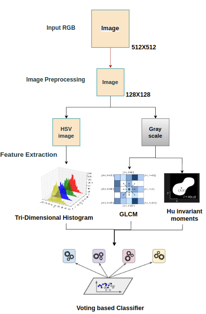

# GROUP 5
# Colon-tissue-classification


# PHASE 1: ML 

## List of feature extraction methods (we tried):

- GLCM
- Hu invariant moments
- First-order statistical features
- Color histogram (RGB, HSV, LAB)
- LBP
- Gabor filter
- Discrete Fourier Transform (mean, median, std_dev, energy from magnitude spectrum)
- Circular hough transform

## Folder structure

Inside phase_1,

- **previous_best** - this folder contains the feature extraction and training pipeline for our previous best approach 
- **analysis** - folder contains scripts for t-SNE and PCA analysis for feature set visualization 
- **analysis\results** - results contains the images that represents the histogram analysis of RGB channels for each type of cancer 
- **utils.py** - feature extraction methods
- **train.py** - training pipeline for voting based classifier
- **submission_pipeline.py** - trains and saves the predictions in the submission format

## Methodology 



For normal training and checking metrics, 
```python
python phase_1/train.py
```

To train the model and generate the predictions CSV file, run
```python
python phase_1/submission_pipeline.py
```


# PHASE 2: DL
